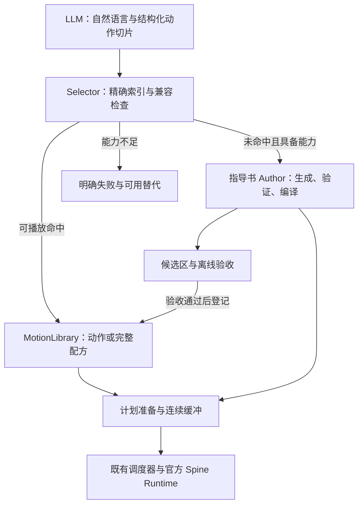

# Pliette 动作生成链路重构开发 Spec v1.0

日期：2026-09-14。面向接手实现的开发 Agent。

**任务性质：在现有工程上重构动作选择与生成入口，同时补齐播放集成。** 保留官方 Spine Runtime、角色档案、指导书、编译器与既有通道调度；建立统一 MotionLibrary，并让未命中动作进入受限 Author。当前交付重点是框架、协议、少量真实种子动作与完整目录备案。大批动作制作留待下一阶段。

本包是开发规格与数据契约，未修改远程代码，未生成新动作资产，也未完成新架构运行验收。

## 1. 本次决策与范围

### 1.1 最终链路



“Selector”是本地确定性路由模块。上游 LLM 做语义规划；命中库后不再调用第二个 LLM 决定取哪条动画。指导书 Author 可沿用同一个模型服务，但只在需要创作时调用。

### 1.2 必须交付

- 异步语义规划接口：自然语言说明与机器可解析的切片指令共同输出。
- 动作语义目录、模型专属实现清单、精确索引、版本与兼容检查。
- 三种载体：原生完整动画/命名切片、已编译的受限 Draft、引用已存在动作的完整配方。
- 预置命中、缺失生成、能力不足、超时、取消和迟到响应的完整闭环。
- 有限连贯序列的预备齐播放，以及具备准入条件的滚动缓冲框架。
- 延迟分阶段计量、Motion Lab 调试入口、真实播放录像与可重建指标。
- 本包目录的落库备案；只迁移和验证少量已有动作，不批量调用模型造库。

### 1.3 本轮不扩张的任务

不更换项目语言，不引入向量数据库、动作生成神经网络、通用 Motion Graph、全身 IK 或另一套渲染器。现有 TypeScript、Ajv、Vitest、官方 spine-ts 足够支撑本轮。

无资产证据的嘴型、手指、背面、接触动作保持能力缺口；托腮仍列入高优先级内容备案，但“目录有托腮”不表示当前角色已经能做。

## 2. 仓库基线与必须承接的问题

核对仓库：[ApolloEddy/Pliette](https://github.com/ApolloEddy/Pliette)。本次读到的最新主分支提交为 [`5c1461d5e62ec04e988bf484761f1987f1f0e909`](https://github.com/ApolloEddy/Pliette/commit/5c1461d5e62ec04e988bf484761f1987f1f0e909)，提交时间 2026-09-10 01:15:31 UTC。开发开始时记录实际 HEAD，若已有后续修复，保留并调整接线，不重复覆盖。

| 真实位置 | 本次核对结果 | 处理方式 |
|---|---|---|
| `src/dialogue/adapter.ts` | 规则版能返回 events；`LlmSelectAdapter.respond` 仍抛异常，接口为同步 | 改为可取消的异步协议；实现真正的 LLM 语义规划与规则版适配 |
| `src/motion/library/gestures.ts` | 9 条 `action/channel/source/start/end` 记录 | 迁移为带身份、语义、写集与验收信息的 MotionEntry |
| `src/motion/library/overlay.ts` | 已有通道过滤与原动画时间窗播放 | 复用；检查进入退出参数真实生效 |
| `src/motion/runtime/scheduler.ts` | 实例当前只登记单个 `channel`；auto 换手主要依据空闲通道 | 扩展为原子多写集实例；必须先确认替代手存在真实动作实现 |
| `src/motion/runtime/gestureLayer.ts` | 固定通道轨道；存在混出 | 保留轨道体系；落实参数、句柄归属与自然回收 |
| `src/motion/author/context.ts` | 通用函数仍硬编码拉菲头身/眼睛说明 | 修复角色知识污染；片段严格来自当前档案和当前控制子集 |
| `src/motion/author/authorBroker.ts` | 新请求替换时提前返回；陈旧响应能删除新记录 | 先修身份隔离；进一步拆开生成完成、准备与开始播放 |
| `src/motion/author/sample.ts` | 向量速率只比较第 0 维；忽略真实混入边界 | 覆盖所有维度、实际合成轨迹、混入混出与接缝 |
| `src/lab/ui.ts` 的 Author 接线 | 仍调用整体预览，并从 track 0 播放/取消；档案固定拉菲 | 接入正式调度器；真实模型快照与局部取消 |
| `characters/*.rig-profile.json` | 有身份、能力、控制域、证据、档案 digest | 沿用单一来源，不另建骨架知识库 |

当前角色：`lafei_8` 导出版本 3.6.52，官方 Runtime 3.6.53。其左右命名混用视角：`hand_R` 是画面右臂、角色自身左臂；不得从名字猜解剖左右，更不能对参数取负后镜像。该事实来自[实际角色档案](https://github.com/ApolloEddy/Pliette/blob/5c1461d5e62ec04e988bf484761f1987f1f0e909/characters/lafei_8.rig-profile.json)。

此前 2026-09-10 修复报告中的 F1–F6 继续有效，以上是本次重新读取代码确认的关键部分。本次没有重跑仓库测试或真实模型实验，不能把 README 的“94 passing”当作本次验收结果。旧实验中约 4.5 秒的数字属于已接纳候选的生成/校验耗时，不是真实首帧延迟。

### 2.1 已有工作与研究借鉴

SAIBA/BML 已采用意图规划、行为规划、动作实现分层，并用阶段同步点协调动作与语音，也讨论了手势仓库。它比自由文本串联更值得借鉴的部分，是**语义描述、可执行实现、时间约束分别建模**。本项目采用轻量 JSON 契约，不接入完整 BML 引擎。[原论文：The Behavior Markup Language, 2007](https://www.techfak.uni-bielefeld.de/ags/soa/publications/doc/BML_IVA07.pdf)

Spine 官方提供轨道分层、队列与混合能力，本项目继续使用这些机制。官方混合能插值，不能据此断言任何两段动作都在语义、支撑和接触上连续；本项目的额外职责是验证这些边界。在线文档可能描述较新的 API，调用以仓库锁定的 3.6.53 实现为准。[Spine：Applying Animations](https://en.esotericsoftware.com/spine-applying-animations)

## 3. “切片指令”与精确索引

### 3.1 三个不同层次

| 名称 | 示例 | 谁定义 |
|---|---|---|
| 语义切片 | “小幅挥手并收回” | LLM 选择已登记条目或声明 custom |
| 库内命名片段 | `full`、经验证的 `hold` | 内容制作流程登记 |
| 生成分段 | 连贯动作中的第 2 个 4 秒单元 | 本地时间协调器按预算划分 |

LLM 不逐帧生成，不输出任意骨骼名，也不直接把原动画的 `4.9–7.3 秒`当作常规控制指令。它只选择已公开的动作、变体、命名片段；原始时间窗由库记录提供。

**逻辑索引键：`actionId + variantId + segmentId`。**

例如 `gesture.wave / small.screen_right / full`。这一键精确定位动作需求，在当前角色中筛选相容的具体实现。实现身份为 `motionId + motionRevision + contentDigest`；其绑定包含模型、档案、Skin、视图和资产版本。逻辑动作键不因换模型改名，数值动画不得跨模型裸复用。

`full` 指完整登记单元，必须含可安全进入/退出的契约；不能把原动画随意截一段就声称是完整动作。

### 3.2 正常命中与未命中使用同一份指令

```json
{
  "schemaVersion": "pliette.motion-plan/1.0",
  "requestId": "request-example-001",
  "catalogRevision": "planning-2026-09-14.1",
  "reply": "好呀。",
  "description": "用画面右侧的手小幅挥手，然后轻轻向画面右侧歪头。",
  "slices": [
    {
      "sliceId": "s1",
      "description": "画面右侧手臂小幅挥手，完整收回。",
      "lookup": {
        "actionId": "gesture.wave",
        "variantId": "small.screen_right",
        "segmentId": "full"
      },
      "parameters": {}
    },
    {
      "sliceId": "s2",
      "description": "轻轻向画面右侧歪头，短暂停留后回正。",
      "lookup": {
        "actionId": "head.tilt",
        "variantId": "gentle.screen_right",
        "segmentId": "full"
      },
      "parameters": {}
    }
  ]
}
```

首期 slices 按数组顺序执行；同时动多个部位通过一个已验证的多通道动作或完整配方表达，不让 LLM 随意建立并行依赖图。动作已作为完整配方登记时，优先输出该 `routine.*` 的一个切片，避免过早拆碎。

**本包示例不代表库命中。** 随附清单全部为 planned，空 manifest 没有可播放资产；实现后由迁移和验收流程逐步填充。

### 3.3 输入字段与规则

| 字段 | 规则 |
|---|---|
| `schemaVersion` | 固定 `pliette.motion-plan/1.0`；未知字段拒绝 |
| `requestId` | 程序发放并要求回显；不得作为永久动作身份 |
| `catalogRevision` | 回显本轮得到的目录版本；陈旧版本不得悄悄映射到新语义 |
| `reply` | 对话文本，可为空；沿用现有输出通路，不再为动作额外生成一遍回复 |
| `description` | 整体动作说明；无动作时可为空且 slices 为 [] |
| `slices` | 0–16 个；总执行时长/输出字节另受程序预算限制 |
| `sliceId` | 本计划内唯一，便于取消、指标与失败定位 |
| `lookup.actionId` | 从当前目录选择；完全未登记的新语义用保留值 `custom` |
| `lookup.variantId` | 精确命名变体；`custom` 动作只能搭配 `custom` 变体 |
| `lookup.segmentId` | 只引用登记片段；初始只提供 `full`；custom 也只能 full |
| `parameters` | 按该变体与实现交集校验；初始大部分为空对象，不开放任意幅度/速度 |
| `durationHintMs` | 可选的软时长意图，不是截断许可；不能牺牲 stroke/recover 去满足数字 |

宿主另存 `planId、actorEpoch、contextId、profileDigest、receivedAtMonoMs、policy、deadline` 等执行信封，均由程序产生。LLM 不拥有优先级、资产路径、原始写集、审批状态、上下文版本或接触资源的修改权。

自然语言与结构化键冲突时不自动播出：例如 description 说“左手”，键却是 screen_right，应做一次有限的纠错请求，仍冲突则返回 `SEMANTIC_CONFLICT`。复杂自然语言无法全部确定性验证；首期强制检查可明确提取的方向、左右、否定和必需接触，并在评测中保留语义符合率，不声称形式校验能证明理解正确。

### 3.4 目录如何提供给 LLM

- 由真实 catalog/manifest 生成紧凑能力卡：键、简短语义、合法变体、可用片段、参数枚举、当前可用状态。
- 目录较小时一次提供所有已注册动作族；增长后用本地类别/别名倒排缩小候选，不引入向量数据库。
- 提供 `playable / generatable / unsupported / planned` 的当前角色投影；不要把所有待制作条目都当作可执行能力。
- LLM 只能引用本轮能力卡中的登记键；缺少合适语义时输出 custom 及完整自然语言说明。程序可通过精确本地目录查全，不为每个切片再发检索 LLM 请求。
- `planning-2026-09-14.1` 是本包备案版本。导入到真实目录后生成新的内容修订号与能力卡，示例中的回显值同步更新。

## 4. MotionLibrary 数据与文件目录

### 4.1 三类记录，不混为一个“预置数组”

| 记录 | 作用 | 状态 |
|---|---|---|
| MotionCatalog | “应该有哪些动作”，提供 action/variant/segment 命名与制作要求 | planned → registered → deprecated |
| MotionEntry / MotionManifest | “当前角色有哪些具体实现”，引用原动画、Draft 或配方 | candidate → validated → approved；任意状态可 disabled |
| PreparedMotion | “本次计划中已准备好可以尝试提交的一段动作” | 会话临时；不可作为公共库存储 |

注册语义可先于素材制作。只有实际文件/原动画存在、版本与能力相容、验收通过的 approved 实现才能进入默认可播放索引。schema 合法或轨迹通过不等于视觉通过。

在线 Author 的通过候选，在在线功能已经启用且通过全部程序检查时，可作为当次 PreparedMotion 运行；记录其视觉质量未经事前人工确认。它进入候选区，后续视觉验收通过才提升为跨会话默认库存。不能自动把每个在线输出变成 approved。

### 4.2 建议目录布局

以下为逻辑位置，可服从当前工程组织微调，但必须保持单一数据来源。

| 位置 | 内容 |
|---|---|
| `src/motion/library/catalog.ts` | 契约解析、目录投影、别名规范化 |
| `src/motion/library/index.ts` | 兼容索引与精确匹配；纯数据逻辑 |
| `src/motion/library/selector.ts` | hit / miss / unsupported / conflict 的判定 |
| `src/motion/library/legacyAdapter.ts` | 旧 GestureDef / Preset / events 到新契约的兼容层 |
| `src/motion/runtime/planCoordinator.ts` | 计划准备、连续 ready 缓冲、取消与时间策略；不直接操作骨骼 |
| `src/motion/runtime/scheduler.ts` | 现有调度器的原子多写集扩展；唯一控制权账本 |
| `src/motion/author/` | 继续承载指导书、客户端、候选校验和 Broker |
| `public/motion-library/catalog.json` | 已注册动作词表；由结构化目录构建 |
| `public/motion-library/models/<modelId>/<viewId>/manifest.json` | 模型专属 MotionEntry 清单 |
| `public/motion-library/models/<modelId>/<viewId>/drafts/` | 可分发的已验收 Draft；沿用 MotionDraft V1.1 |
| `public/motion-library/models/<modelId>/<viewId>/boundaries/` | 已采样的边界与必要接缝证据 |
| `public/motions/` | 旧资产暂留，先引用/适配，兼容结束后才移除重复来源 |
| `docs/motion-library/catalog-plan.json` | 本包动作需求备案；不作为 runtime manifest |
| `docs/motion-library/production-plan.md` | 逐模型制作方式、缺口、证据要求、优先级 |
| `experiments/motion-library/` | 基准结果、请求/诊断/录像索引 |
| 应用用户数据目录 `motion-library/candidates/` | 在线/离线待审候选；不能写入打包后的 public |
| 应用用户数据目录 `motion-library/approved/` | 用户本地已验收资产，可通过原子 manifest 更新加载 |

第一版用 JSON 清单与内存 Map，启动只读必要元数据，曲线按需加载。无需数据库。浏览器 Lab 可用现有静态文件入口和导入导出；持久写入走既有宿主能力，不虚构浏览器可以任意写 public。

### 4.3 Catalog 的字段

完整机器契约见 `motion-contracts.schema.json` 的 `MotionCatalog / CatalogAction / CatalogVariant`。

| 层级 | 字段 | 含义 |
|---|---|---|
| 根 | `schemaVersion, catalogRevision, description, categories, actions` | 格式版本、内容版本、分类与动作数组 |
| 动作 | `actionId, label, category, aliasesZh` | 稳定英文键、中文显示名、类别与明确同义词 |
| 动作 | `priority, status, productionNote` | 制作顺序、登记状态、制作要求 |
| 变体 | `variantId, description, side` | 命名版本及 asset-view 方向；双方均须真实制作 |
| 变体 | `segmentIds` | 可引用片段；首期只 full |
| 变体 | `requiredCapabilities` | 待映射的语义能力要求；不是 controlId，也不直接授权 |
| 变体 | `parameterSchema` | 允许参数、类型、枚举/范围；未登记参数一律拒绝 |
| 变体 | `authorable` | capability_check 或 disabled；不保证生成成功 |
| 变体 | `status` | planned / registered / deprecated |

首期不要为“开心×小幅×左手×快×三次”穷举所有排列。语义关键差异做命名变体；风格、节奏与循环只有经实现验收后才开放有限参数。别名必须唯一指向登记语义；相近动作不是同义词。

### 4.4 每个 MotionEntry 的具体字段

| 字段 | 内容与强制语义 |
|---|---|
| `schemaVersion` | `pliette.motion-entry/1.0` |
| `motionId, motionRevision` | 实现的稳定 ID 与不可变修订；不要用一次请求的 requestId 命名 |
| `actionId, variantId` | 指向已注册逻辑动作与变体 |
| `status` | candidate / validated / approved / disabled |
| `rigRef` | modelId、profileId、profileDigest、assetDigest、referencePoseDigest、viewId、skinId、runtimeVersion、adapterVersion |
| `source` | native_clip / native_slice / draft / recipe 的判别联合 |
| `source.animationName, sourceStartMs, sourceEndMs` | 原动画引用与源时间窗；单位整数 ms；native_clip 必须覆盖完整源动画 |
| `source.path, contentDigest, draftSchemaVersion` | Draft 相对路径、摘要与 V1.1 版本；公共路径由宿主解析，LLM 不提供 |
| `source.steps` | 配方子动作固定 motionId/revision/digest、segmentId、offsetMs 与已验证参数；不在运行中重新语义检索 |
| `durationMs` | 该实现原始时间轴长度；不得与源窗口、步长、事件时刻矛盾 |
| `channels` | 现有七通道；实现实际写入的通道集合 |
| `writes, dependsOn` | 来自真实 Timeline/ControlProfile 的属性写集及祖先/约束依赖；不可只凭通道名推定不冲突 |
| `requiredCapabilities` | 该实现依赖的真实能力映射 |
| `preconditions` | 允许姿势、基础动画、资源和接触；空集合的含义须由字段确定，不得混为“未知且任意” |
| `segments` | 名称 → startMs/endMs、进入/退出边界 ID、末端能否中断；full 必须存在 |
| `boundaries` | 边界 ID → poseClass、snapshotRef、contacts、resources；快照还包括实际属性、必要速度与基础层条件 |
| `parameterSchema` | 此具体实现的合法参数；必须是语义目录许可的子集 |
| `retime` | 已验证 playbackRate 最小/最大；初始只允许 1.0，验证后再扩展 |
| `loop` | 是否可循环、循环片段、最大次数；不能任意复制整段来延长 |
| `transition` | mixInMs、mixOutMs、最大允许混合窗、是否已验证可作为连续分段 |
| `events` | 有限的接触/物品事件、唯一 eventId、时刻与资源 ID；不能携带脚本 |
| `provenance` | native / legacy_slice / agent_offline / author_online / recipe，来源引用及模型/提示摘要 |
| `validation` | structural、trajectory、visual、evidenceRefs、reviewedAt；approved 必须全部通过且有证据 |
| `contentDigest` | 该修订规范化记录的摘要，排除自身 digest 字段，并纳入所有被引用的资产摘要 |

`profileDigest` 继续使用仓库既有算法；`contentDigest` 用现有可用的 SHA-256 实现对规范化 JSON 计算，不替换旧档案摘要算法。摘要不是签名，必须实际计算，不能信任导入文件自报摘要。

preconditions 的明确规则：`postures=[]` 和 `baseAnimations=[]` 仅表示该维度已验证不限制；制作时尚未测试必须保留 candidate，不能用空数组冒充全覆盖。`requiredResources=[]` 与 `requiredContacts=[]` 表示无此类前提。首期对源切片优先填写实际验收的姿势/基础动画。

### 4.5 必须补充的语义校验

JSON Schema 负责形状；以下由 TypeScript/Ajv 后续确定性校验承担：

1. actionId、variantId、motionId+revision 唯一；引用全部存在；catalogRevision 一致。
2. `full=[0,durationMs]`；每个片段 `0≤start<end≤duration`；原动画时间窗不越界。
3. source、segments、events、配方总时长与实际播放时间一致；舍入仅发生在边界转换。
4. 参数通过“目录允许域 ∩ 实现验证域”；`minRate≤maxRate`；循环只有明确窗口才允许。
5. 配方无环、深度首期≤2、展开后≤32步；冻结依赖修订；不能把缺失子动作跳过后报整套成功。
6. 边界快照和 requiredCapabilities 已映射到当前档案/场景。未知 capability 返回未支持，不当作可授权控制。
7. writes 必须等于从真实资源得到的写集；head 和 face 名称不同仍可能写相同眼睛 Slot。
8. 只有当前连续前缀已准备好才计入缓冲；跳过一个缺失动作后的后续已缓存动作不能提前算入可播放秒数。
9. 已失效 profile/asset/revision 的实现移出可播放投影；热更新为原子替换，新旧引用不能混用。
10. 时间拉伸后重算速度、窗口、事件与混合时长；快放会提高速率，不能只验证原曲线。

## 5. Selector 行为：什么情况下真正算命中

### 5.1 确定性流程

1. 校验 MotionPlan 的形状、回显身份、目录版本、切片数和参数。
2. 解析精确动作键；唯一的静态别名可在进入索引前规范化，但要记录原键。
3. 查 `actionId + variantId + segmentId`，并按当前 rigRef、姿势、资源、参数域和验收状态过滤。
4. 多个合格实现按固定规则选取：项目维护的 preferred 实现优先，其余按已批准修订与稳定 ID 排序。preferred 是构建配置，不让 LLM 给评分。固定输入和库版本应产生固定结果。
5. 原生切片、离线 Agent 动作和已验收在线动作地位相同；来源不能越过验收与兼容检查。
6. 没有可播放实现时，保留切片原文、逻辑键、参数、时间需求与失败原因，检查当前角色生成能力，然后调用指导书。
7. 能力不足返回 unsupported；占用冲突交给调度器排队/退出策略，不再次让 Author 生成“另一条同样占手”的动作。

### 5.2 路由结果与回退

| 结果码 | 后续动作 |
|---|---|
| `HIT_READY` | 获得固定实现引用并进入准备阶段；提交前仍核对实际状态 |
| `MISS_ASSET` | 已知语义但当前模型没有已验收实现；具备能力才交 Author |
| `MISS_SEGMENT` | 命名片段尚未实现；自然语言足够明确才生成，否则 needs_context |
| `MISS_CUSTOM` | custom/custom/full：按完整自然语言交 Author；成功后仍不自动造新公共 ID |
| `UNSUPPORTED_CAPABILITY` | 不调用不可能完成任务的 Author；报告缺口及明确的替代动作 |
| `RIG_MISMATCH / ASSET_MISSING` | 不复用错误资产；可降为当前角色生成请求，前提仍是能力可满足 |
| `RESOURCE_CONFLICT` | 排队、按既定规则抢占或失败；不计为库缺失 |
| `INVALID_REFERENCE / SEMANTIC_CONFLICT` | 最多一次有界纠错；不把拼写错误当新动作自动扩库 |
| `GENERATION_TIMEOUT / VALIDATION_FAILED` | 保持已验证基础行为或安全退出；记录动作未完成 |

若整个请求是一条已有完整 routine，直接解析该 routine。若明确是多个顺序切片，按序解析，不另外用模糊搜索猜“差不多的整套动作”。

默认命中库的增量 Author 调用数必须为 0。上游语义 LLM 自身的延迟仍然存在，要单独统计，不能宣传“库命中后总交互零延迟”。

auto 换手只允许在语义确实允许换手、替代变体真实存在、兼容且已批准时使用。显式要求画面左手的动作不得静默改用右手。方向以 asset-view 为基准；用户说“角色左手”时根据档案转换，不套用 R/L 文件名。

## 6. 指导书 Author 的接入与动作生命周期

### 6.1 同一语义请求的生成上下文

本地构造一个 `AuthorTask` 内部对象：原 MotionPlan 切片、当前/预期边界、完整动作的短摘要、目标时长、当前 guideRequest、关联 planId/sliceId/unitIndex。该对象是宿主协调信息，不直接混入严格的 V1.1 响应对象。

复用 `assembleRequest`：

- goal 包含切片自然语言、精确动作键和不能省略的要求。
- availableControls 只来自当前模型、当前任务允许的控制子集；依赖说明不增加可写权限。
- mandatoryRules 完整保留；同一档案源生成离线指导书和运行时片段。
- 首尾边界要求、前后动作摘要作为独立标记的生成上下文加入指导片段；程序另行保存同份结构化边界，并在输出后真正校验，不能只靠提示词。
- LLM 仍返回 `pliette.motion-draft/1.1` 的 motion / unsupported / needs_context；不要向旧判别联合擅自加未知字段。
- 第一版不要求模型执行时间计算：宿主给出确定目标时长、边界锚点和预算；模型填稀疏曲线。

### 6.2 原有 2 秒预算与新时间策略的关系

当前 `DEFAULT_BUDGET.maxDurationSec=2.0`、总键≤24、截止 2500ms。它不能直接承担 3–5 秒分段。本轮增加显式命名配置，在请求、客户端、校验器与 Broker 中使用同一份预算来源：

| 配置 | 默认任务时长 | 初始键预算 | 用途 |
|---|---|---|---|
| `legacy` | 沿用 0.4–2.0 秒 | 沿用旧值 | 保持旧实验可复现 |
| `interaction` | 0.4–5.0 秒 | ≤6 控制、每曲线≤6 键、总键≤24 | 一次准备完成的短动作 |
| `continuation` | 目标 4 秒，允许 3–5 秒 | 同上；超预算则缩小任务，不无限加键 | 滚动生成的完整单元 |

新模式输出上限初值仍为 1536 tokens / 32 KiB；截断响应直接失败，不补播半个 JSON。interaction 的首轮总准备硬截止初值 8000ms，soft 目标 2000ms；这些是可配置的产品预算，不是模型性能结论。新模式只有完成实际时长、轨迹、混合和长序列验收后才启用，不能仅改上限数字就宣称已支持。

有限多单元序列使用单独的 `bufferedSequence` 总准备预算，hard 初值30000ms；每次 Author 调用最多8000ms且不得超过计划剩余预算。它与单个短动作的8秒预算分别配置，避免把需要准备多段的长动作永远截死在同一8秒限制内。滚动单元的截止还要受“实际可播放前缀耗尽前的最晚完成时刻”限制。

可以为极简单长 hold 采用已经验证的本地循环/持有，无须让 LLM 逐秒重复写相同关键帧。更复杂动作超过预算时切成有明确边界的完整单元；若无法安全拆分，整段离线制作。

### 6.3 Broker 与播放必须分开

现有 Broker 的“生成完成立即 commit 播放”不足以承载预生成。重构为：

| 阶段 | 所有权与检查 |
|---|---|
| `beginGeneration` | 在真正发出请求前登记身份、单调截止、取消令牌；一个 actor 首期最多一个 Author 调用在途 |
| `acceptGenerated` | 校验/编译/采样后关闭生成生命周期，产出 PreparedMotion；不申请播放通道、不自动播 |
| `enqueuePrepared` | 放入当前计划的连续 ready 前缀；冻结依赖、预测边界和资源需求 |
| `commitPrepared` | 到播放时再次核对模型、外部状态、实际边界与权属，然后原子取权并播放 |
| `releasePlayback` | 自然结束、混出、取消和异常都释放句柄；旧实例清理不能碰到新实例 |

生成截止限制“何时产出并验证完候选”；播放截止限制“这次交互何时开始还有效”。准备好的合法动作不能仅因为已超过它的生成请求截止而在稍后播放时被误删。

新请求取消旧请求后必须完整登记新记录；所有清理必须比较 requestId/planId/实例 token。超时、旧响应、重复回调不准删除新请求或新轨道。AbortController 负责中止网络；停止不了服务端计算时也必须隔离迟到结果。

### 6.4 多段计划的状态版本

从真实角色读取状态。`actorEpoch` 标识换模型、Skin、视图或外部干预造成的语境变更；旧计划失效。连续动作自身按照已确认计划完成的状态变化，通过 `expectedPrefixHash + expectedBoundary` 衔接，不得每播一段就把所有预生成后段都当作陈旧。

生成下一段时使用前段**已编译并经官方运行时采样的预测结束状态**。开始播放下一段时比对真实状态。超出验证容差则重新验证/重生成未播后缀，不能硬贴上去；连续相位的自然时间推进不等于语义上下文改变。

模型切换、第三方占用、用户取消、接触变化、计划替换均应有明确的失效范围。第一版可保守地使整个未播后缀失效，但正在退出的句柄仍须回收。

## 7. 减少等待并保证连贯的时间控制

### 7.1 三种播放方式

| 方式 | 何时使用 | 启播规则 |
|---|---|---|
| 预置动作/完整配方 | 所有素材已准备 | 完成选择、兼容和边界检查后立即调度 |
| `buffered` | 默认；单个动作或有限连贯序列 | 一次请求的全部必要单元准备好后再开始；开始后不等待 LLM |
| `rolling` | 较长动作，且当前 provider 有速度/质量证据 | 连续 ready 秒数满足启动阈值后播放，提前生成后续完整单元 |

首期生成型计划总时长上限初值 30 秒、语义切片≤16；已有库的长配方也受可配置的展开与资源预算限制。更长有限任务通过明确的下一段计划扩展，不能生成无界 JSON。

12 秒不可停顿的表演，默认先备齐全部12秒再播；大部分已命中的动作只需准备缺失部分。只有 rolling 通过下述准入时才提前启播。不是“收到第一个 token 就开始动”，也不是把每个1秒段交给 LLM 临时续写。

### 7.2 两个时钟与两个延迟

- wall time：请求、排队、网络、验证、准备、首帧，用单调时钟，单位 ms。
- motion time：曲线、切片、相位，库协议用整数 ms，进入既有 Spine/Draft API 时统一换算为秒。
- `T_feedback`：用户看到合理等待反馈或待机变化的时间。
- `T_action_start`：真正请求的动作第一次产生可观察帧的时间。

保持呼吸/待机可以避免角色像程序挂起，但不能把待机首帧记作“托腮已开始”。buffered 等待超过 soft 预算时允许展示简短准备状态；到 hard 截止仍未准备好，则本次动作超时，不暗中无限等待或突然补播。

### 7.3 rolling 的可持续性与缓冲

定义：`D_i` 为第 i 段新增可播放时长（扣除重复 overlap）；`L_i` 为产出该段的生成+验证+编译用时，包含为它付出的失败尝试；单元 `RTF_i=L_i/D_i`，整段 `RTF_total=ΣL_i/ΣD_i`。对连续输出，RTF_total≥1 代表平均生产速度已经追不上消费速度，有限缓冲只能延后耗尽。

初始准入目标：同一模型配置与相似动作复杂度，**单元 RTF_i 的实测 p95≤0.7，且 RTF_total<1**，并有端到端播放记录。0.7 是本项目预留抖动余量的设计目标，并非行业定律。被拒稿、重试、超时均纳入有效产出耗时；永久没有产出完整段的请求另计失败，不从报告中消失，不能只统计成功请求得出偏快结果。

设 `L95` 为下一完整单元准备时延估计，`J` 为采样抖动余量、初值 500ms：

- 启播需至少两段相容单元已 ready，且连续 ready 秒数 `B_start≥max(首段时长, L95+J)`。
- 启播后，只要有未完成后缀且生成器空闲，就尽早生成下一段；缓冲降至 `L95+J` 是最迟启动告警线，不是故意等到该值才工作。
- 持续观察剩余 ready 时长和 tail latency；速度回退时，取消未来 rolling 准入，改为 buffered。
- 第一版 buffer 内准备时长上限初值 15 秒/6 单元；启动阈值超过上限时不启用 rolling。不得无限预生成掩盖速度不足。
- 缓冲耗尽前，到已登记安全点进入有上限的 hold 或安全退出；无安全点的不可中断动作必须预备齐后才启播。

例：每段实际新增3.8秒，准备一次约4.6秒，RTF约1.21，明显不能持续滚动。这里仅是算术示例，不能拿旧2秒候选的实验直接预测新4秒段表现；必须新测。

### 7.4 分段连续性

每段生成前冻结：起点 pose/速度、必须保留的接触与持物状态、写集、已确定的下一个边界、整条动作简短摘要。后段继承前段采样结果，不重新从 setup 开始。

相邻单元允许有约200–400ms的重叠候选窗，实际长度须由边界验证决定，不能固定贴0.4秒就宣布平滑。共享 overlap 必须使用同一份已确认参考轨迹或经联合采样验证的过渡；重复 overlap 只播放一次，不重复计算新增时长。

检查位置/角度连续、速度变化、约束、附件切换、物体归属和脚底/接触点。C0 连续不代表速度连续。现有 linear/smooth 能力不足以任意指定端点切线时，优先在低速或稳定相位接段；禁止每段末尾统一归零或 smooth 到静止造成周期性停顿。不得以另写复杂运动合成器解决本轮边界问题。

离散附件切换有明确的唯一时刻；contact/object 事件以 `planId + occurrenceId + eventId` 去重。循环时每次合法 occurrenceId 不同；跨 overlap 同一次事件 ID 相同，只提交一次。物品抓取到放下的链不能切在不可撤销中间状态却没有退出方案。

### 7.5 具体时间目标与实验口径

以下均是实现目标，不是当前已达成值。目标硬件固定后记入报告。

| 指标 | 初值/目标 |
|---|---|
| 热索引查找与过滤 p95 | ≤5ms，1万条合成元数据；不含磁盘与编译 |
| 已预热库的 planAccepted→真实首帧 p95 | ≤100ms；与上游 LLM 用时分开 |
| interaction 首动作准备 soft 目标 | ≤2000ms；超过可合理等待 |
| interaction 从计划接受起 hard 截止 | 8000ms；所有切片共享这次预算，不是每个切片重开8秒 |
| bufferedSequence 总准备 hard 截止 | 30000ms；单次生成≤8000ms，且受总剩余预算限制 |
| rolling 准入 | 有效 RTF p95≤0.7；L95+J 缓冲、质量合格 |
| 单次连续播放验收 | 至少一条15秒生成/混合序列；目标区间内无补粮停顿、意外归零或重复事件 |

首期优化顺序：完整配方命中 → 现有子动作命中 → 紧凑能力卡与指导片段缓存 → 稀疏关键帧 → 有限计划提前准备 → 有证据的 rolling。provider 更换和竞速不是本轮必须项，不能用标称 tokens/s 代替端到端测量。

## 8. 统一调度与官方播放

复用 `MotionScheduler` 扩展实例：从单 channel 改为 `channels[] + writes[] + resources[]`，保留兼容适配器。一次组合动作要么一次性拿到全部所需写集，要么一个都不拿；不得左手成功后右手失败仍报告完整动作完成。

`PlanCoordinator` 管准备和时间，Scheduler 管实际所有权，AuthorBroker 管生成身份。只允许 Scheduler 建立控制权事实。Author、预置、用户交互和 ambient 都通过同一个提交入口。

基础层持续存在，覆盖它的上层动作获得指定属性的临时控制权；基础动画天然写满骨骼不能被误判为“所有手势永远冲突”。区分基础层可被覆盖的写入与其他活动动作的排他写入。head/face、祖先变换、IK 或接触依赖须额外检查。

track 0 继续基础动画，1–6 沿用既有 leftArm/rightArm/torso/head/face/mouth 布局。同通道前后段 handover 由同一计划控制权续接，不能先无条件交还基础层再取回。原生完整基础动作由 base 路径播放；多部位 overlay 使用经过审核的过滤写集。

现有 `playSlice` / `GestureLayer.play` 接受 mixIn 参数但没有完整落实，应检查3.6.53实际混合行为并修正适配层。不得修改 vendor Runtime。取消旧句柄前确认它仍拥有对应 track；后来的动作已接管时，旧回调不得 `setEmptyAnimation` 清掉新动作。

不通过循环调用 `setToSetupPose`、全局 clearTracks 或重建 AnimationState 掩盖接缝。实际动画时间、scheduler duration、timeScale、mixOut 与触发事件必须一致。自然结束与异常退出均释放记录，不能只依靠 FIFO 淘汰仍在播放的实例。

### 8.1 时间轴归一规则

`durationMs` 表示内容时间轴：native_slice 等于源窗口长度，Draft 等于 draft.durationSec×1000。普通独立动作的进入混合在内容前、退出混合在内容后，各使用边界姿态；不靠吞掉 stroke 的前后若干帧完成混合。有效占用时长为 `mixInMs + durationMs/playbackRate + mixOutMs`。内容事件在进入混合结束后按变速后的内容时间触发。

连续单元 handover 则使用经过验证的共享过渡，不能每段额外退回基础层；ResolvedSchedule 必须把实际 in/out/overlap 显式折算，重复部分只计一次。配方 step.offsetMs 是该子动作有效占用区间在配方时间轴上的起点；recipe.durationMs 覆盖最晚子动作结束，recipe 自身首期 mixIn/mixOut 均为0，避免套两层混合时间。调度、buffer和录像标记都读取同一份 ResolvedSchedule。

### 8.2 PreparedMotion 最低内部字段

| 字段 | 作用 |
|---|---|
| `preparedId, planId, sliceId, unitIndex` | 宿主分配；精确定位准备单元，不复用库动作身份作为实例身份 |
| `generationRequestId` | 可空；命中预置时为空，生成时追溯请求 |
| `actorEpoch, profileDigest, expectedPrefixHash` | 角色与计划前缀身份 |
| `sourceRef, resolvedParameters, compiledHandle` | 冻结实现/临时候选引用、已解析参数和本地编译对象 |
| `writes, channels, resources` | 由验证器派生，供唯一 Scheduler 原子申请 |
| `entryBoundary, exitBoundary, expectedState` | 官方运行时预测值与离散前提 |
| `resolvedSchedule, newPlayableMs` | 精确执行时间轴与去重后的可新增时长 |
| `readyAtMonoMs, playbackDeadlineMonoMs` | 准备完成与播放时效；不使用已结束生成任务的旧截止 |
| `validationReportRef, disposalToken` | 验证证据、缓存 pin 与准确回收标识 |

PreparedMotion 不携带可供 LLM 改写的 `approved=true`。prepared 只是“当前准备完成”，实际 commit 仍可能因外部状态改变而失败。

## 9. 动作目录备案与本轮种子迁移

详细目录见 `MotionLibrary_Catalog_Plan.md` 和 `motion-catalog.plan.json`，共12类、110个动作族、154个命名变体。目录覆盖生命感、头部、注视、面部、手势、身体、移动、姿势、接触、物品、情境反应、完整配方。所有条目先记 planned，不制作承诺中的大库。

### 9.1 旧库的9条种子如何迁移

| 旧记录 | 源时间窗（秒） | 新逻辑动作 | 特别处理 |
|---|---|---|---|
| wave / rightArm | stand 4.9–7.3 | gesture.wave / small.screen_right | 保留已有语义，补完整边界和退出验收 |
| wave / leftArm | stand 13.0–13.9 | gesture.raise_hand / screen_left | 旧标签实际是短促举手，不能继续充当挥手精确命中 |
| dizzy / head | yun 0.4–2.0 | reaction.dizzy / small | 带头部的完整反应；不能无检查缩为 face.dizzy |
| happy / head | touch 0–0.67 | reaction.happy / small | 验证实际附件与头部写集 |
| shy / head | sit 0–1.33 | reaction.shy / small | 标明使用前提，不能仅因为源叫 sit 就推断任意站姿可用 |
| pump / rightArm | victory 3.3–4.1 | gesture.pump / screen_right | 验证完整回收 |
| fresh / head | normal 0.5–2.5 | life.idle_fidget / default | 暂作候选语义，需视觉核实再登记为具体实现 |
| point / rightArm | attack 0.15–0.7 | gesture.point / screen_right | 检查指向与手势一致性 |
| touch_table / rightArm | victory 0.7–1.2 | contact.touch_table / screen_right | 绑定已测桌高/场景；目录存在不等于支持任意桌子 |

再检查 `public/motions/llm_nod.json` 与 `llm_lean_blink.json`，按离线 Draft 导入方式迁移。保留来源身份，但为当次执行建立新身份并重新验证；不得全局放松在线 requestId 回显校验。

首期真实素材最低验收：从以上可用资源中形成≥6个可播放实现，至少涵盖 native_slice、Draft、多通道动作和1个完整 recipe。没有拉菲资产时，先用仓库已附官方示例完成能做的集成与机制验收，拉菲迁移如实标为待本机验收；不能创造录屏或把空实现标为通过。

### 9.2 给后续内容 Agent 的备案任务

对每个 action/variant 增补 production-plan：适用模型、真实控制/原动画映射、制作方法（原生提取/组合/指导书离线产出）、必要标定、状态前后条件、参考效果、验收录像和成本估计。能力缺失写 blocked，并说明缺哪项资产/控制。

先复用专业原动画；再用已验收动作组合；最后离线 Author 制作缺口。每次产出完整的可复用单元与命名相位，不存成上千个没出处的逐帧数组。登记人工修改与 Agent 生成的来源差异，但沿用同一验收标准。

离线批量队列支持预算上限、断点续跑、按逻辑键去重和失败记录即可；这轮只建任务数据格式与入口，不启动全量生成。

## 10. 缓存、入库与失效

- 索引键中的模型维度至少包括 profileDigest、assetDigest、viewId、skinId、runtime/adapterVersion；版本变化必须失效。
- 静态指导片段缓存至少包含 profileDigest、控制集合、规则版本。动态快照不可混入静态缓存。
- 生成任务去重键需包含完整语义约束、逻辑键、参数、起止边界、目标时长、档案和生成配置摘要；不能仅按“挥手”两个字复用。
- 新候选写入候选区，先完整落盘再原子登记；崩溃留下半文件不得出现于可播放索引。
- 配方依赖固定修订；库更新不改写正在播放计划。当前加载快照释放后再回收旧缓存。
- 单纯文件存在不代表可用；损坏、摘要不符、源动画缺失、编译失败须隔离并给出错误原因。
- 临时 compiled cache 采用有界 LRU，正在播放和 ready buffer 使用中的对象必须 pin，不能被淘汰。
- 原始网络响应身份只用于追溯；持久资产与当次播放授权分开。在线候选不得因一次运行通过就自动跨角色/跨场景复用。

## 11. 分阶段执行计划

| 阶段 | 工作 | 可审查产物与完成标准 |
|---|---|---|
| M0 基线与修复 | 确认 HEAD/AGENTS；复核旧 F1–F6；先修请求身份与角色知识，再修采样/播放路径 | baseline-report、针对性回归、真实问题对应修复；不把 README 数字当测试结果 |
| M1 契约与索引 | 导入本包 schema/目录备案；实现语义校验、清单与索引；迁移旧入口 | 固定键确定性解析、零伪命中、空库可启动、无数据库依赖 |
| M2 Select 与统一调度 | 异步适配器、真实 LLM 协议、规则版适配、多写集原子实例 | 对话→MotionPlan→库→真实播放；命中不调用 Author |
| M3 缺失生成闭环 | AuthorTask 装配、预算单一来源、PreparedMotion、buffered、离线导入 | 已知缺失→生成→验证→首帧；超时/取消/错角色无迟到播放 |
| M4 长动作与时间控制 | 完整单元、边界承接、连续 ready buffer、rolling 准入与退化 | ≥15秒序列验收；慢 provider 自动拒绝 rolling；不可中断任务预备齐 |
| M5 收尾与内容备案 | seed 验收、README、制作计划、性能和录像 | 代码/目录/能力投影一致；大库制作明确留后续 |

M1/M2 的库命中功能不必等在线 Author 质量全部达标才交付。模块可在同一项目逐项提交；本 Spec 不要求另起服务或多 Agent 并行开发。

原 `online Author 默认关闭直到 p95≤2秒` 是早期统一门槛。本 Spec 根据“单次动作可以等待，连续动作不能卡顿”的新要求，**替换为按模式启用**：buffered 满足明确等待预算、播放正确性和质量证据后可启用；rolling 另需可持续速度与缓冲证据。不能把“2秒门槛取消”解释为绕过校验或自动启用未知质量模型。

Mock 用于身份、时间与错误注入；真实 provider 通过当前宿主的凭据/配置机制接入。开发中的默认运行不新增多 provider 竞速、无限重试或全量付费批量生成；没有可用配置仍应把契约、编译、播放器和可运行实测命令做完并标清未测部分。

## 12. 必须覆盖的验收场景

只新增能检出真实回归的测试，不为 getters 和简单字段逐项堆测试。保留现有 typecheck / test / build，并按需补集成录像。

| 用例 | 预期结果 |
|---|---|
| V01 完整 routine 命中 | 固定版本配方被展开并播放；Author 调用0次 |
| V02 已知动作缺素材 | 同一语义切片进入当前角色指导书；通过后按计划播放 |
| V03 custom 动作 | 完整自然语言进入受限生成；不自动污染公共命名目录 |
| V04 planned 或 disabled 条目 | 不算可播放命中，不显示“已有此动作” |
| V05 左右手与变体 | 显式左手不播右手；旧左手举手不误当挥手；auto 只选真实可用变体 |
| V06 错模型/档案/Skin/视图/缺源资产 | 不复用错误数值或资源；准确报告原因 |
| V07 非法片段/参数/时间伸缩 | 拒绝越界、任意裁切与未经验证变速；不静默截幅 |
| V08 多通道与共享写集 | 双通道一次取权；head/face 隐含冲突被发现；基础层仍正常 |
| V09 取消与旧回调 | 只释放本实例；旧响应/旧 dispose 不清除新请求或新动作 |
| V10 连续前缀缓冲 | s2 未 ready 时，s3 缓存不增加可用前缀秒数；无越序播放 |
| V11 预测状态接续 | 自身计划推进不误杀后段；外部换角/干预让未播后缀失效 |
| V12 buffered 12秒动作 | 备齐才启播；播放途中网络断开也能完整完成 |
| V13 rolling 15秒动作 | 新增时长正确扣 overlap，接缝不重复事件，缓冲不空 |
| V14 慢/抖动/拒稿 provider | RTF 不达标不启用 rolling；耗尽风险走有上限安全退出 |
| V15 纯Y轴运动与混合窗口 | 超速不漏检；进入退出、循环与过渡纳入采样 |
| V16 物品/接触事件 | overlap 不重复抓取；取消后的归属与资源回收正确 |
| V17 导出重导入/损坏文件 | 新执行身份有效，来源可追溯；摘要/引用错误被隔离 |
| V18 库热更新 | 已冻结计划继续引用旧修订；新计划使用新投影，无混用 |

所有需要真实画面判断的结果必须有画面证据。官方示例机制通过与拉菲视觉通过分别报告，不互相替代。上面物品/接触未具备资产时可用确定性资源事件验证机制，并明确角色动作仍未完成。

### 12.1 日志与指标

每条请求保存：runId、planId、requestId、sliceId、unitIndex、actorEpoch、catalogRevision、profile/asset digest、provider与参数、来源命中、完整输入/首稿/清理后输出、诊断、最终状态和录像引用。密钥不进入记录。

时间点：用户事件、semanticRequest、semanticReady、planAccepted、lookupDone、authorQueued、authorSent、firstToken、responseComplete、validationDone、compileDone、readyAt、firstActualFrame、completedAt。实施时尊重真实先后顺序；如果编译属于验证内部，要记录独立区间，不重复累计耗时。

分别报告：语义键合法率、语义符合率、可播放命中率、首稿验证通过率、合理 unsupported、实际执行完成率、视觉通过率、超时/取消、准备 RTF、bufferUnderrun 次数。失败请求保留在分母；首帧分位数写明只对哪些成功样本统计，并同时给失败率。

至少完成：离线命中与错误注入集成；一条12秒 buffered 和一条15秒 rolling 的可复現播放；有真实服务时对固定任务集做不少于20次在线样本用于首次估计。样本不足或复杂度不一致时不把 p95 当稳定承诺；生成速度准入继续采用保守 fallback。

## 13. 交付清单与 Agent 执行入口

最终实现交付：代码提交、当前基线与复用映射、迁移的 manifest/素材、schemas 与示例、目录备案和制作计划、真实通过/跳过测试明细、动作录像、完整逐阶段指标、未完成能力与模式启用状态。

本包包括：

- `Pliette_MotionLibrary_Refactor_Spec_v1.0.md`：本规格。
- `MotionLibrary_Catalog_Plan.md`：完整动作目录的人类可读版本。
- `motion-catalog.plan.json`：动作族、变体、能力要求和制作说明；全部 planned。
- `motion-contracts.schema.json`：Draft-07 结构契约，可接项目既有 Ajv。
- `motion-plan.examples.json`：精确引用、能力缺口和 custom 三类输入示例。
- `motion-manifest.empty.json`：可启动的空清单；不包含假资产。

包内数据已做 Draft-07 schema 校验、目录唯一性与分类检查、3份计划示例的结构与引用检查，以及未知字段和非法时长的拒绝检查。该检查不涉及真实资产、TypeScript 接线或动作视觉质量；这些仍由上述实施验收完成。

可直接交给开发 Agent：

> 在现有 Pliette 仓库按本 Spec 实现 MotionLibrary 优先、未命中指导书生成的动作链路重构。先确认实际 HEAD 与已有修复，复用官方 Runtime、档案、Compiler 和 Scheduler；按 M0–M5 推进。以本包 JSON 契约为结构基线，补齐文中确定性语义校验。先迁移少量真实种子动作、打通异步 Select 和真实分层播放，再做 buffered/rolling。目录全部先备案，不批量生成动作。不用通过放松身份校验、忽略左右差异、占位动画或仅 Mock 日志来满足验收。完成后交付提交、测试明细、可看录像和实际延迟；未取得的资产、真实服务或视觉证据如实列明，并完成其他可执行部分。

## 14. 核对来源

本 Spec 的设计要求由本次用户指令制定；外部论文只用于架构借鉴，不能替代项目验收。

- [当前 README 与模块列表](https://github.com/ApolloEddy/Pliette/blob/5c1461d5e62ec04e988bf484761f1987f1f0e909/README.md)。
- [原指导书 Spec](https://github.com/ApolloEddy/Pliette/blob/5c1461d5e62ec04e988bf484761f1987f1f0e909/docs/Pliette_Spine_Motion_Guide_Development_Spec_v1.0.md)。
- [真实 Select 适配器状态](https://github.com/ApolloEddy/Pliette/blob/5c1461d5e62ec04e988bf484761f1987f1f0e909/src/dialogue/adapter.ts)。
- [旧手势素材与精确时间窗](https://github.com/ApolloEddy/Pliette/blob/5c1461d5e62ec04e988bf484761f1987f1f0e909/src/motion/library/gestures.ts)。
- [Author V1.1 协议与预算](https://github.com/ApolloEddy/Pliette/blob/5c1461d5e62ec04e988bf484761f1987f1f0e909/src/motion/author/protocol.ts)。
- [Author 身份生命周期](https://github.com/ApolloEddy/Pliette/blob/5c1461d5e62ec04e988bf484761f1987f1f0e909/src/motion/author/authorBroker.ts)。
- [当前指导片段装配](https://github.com/ApolloEddy/Pliette/blob/5c1461d5e62ec04e988bf484761f1987f1f0e909/src/motion/author/context.ts)。
- [当前采样实现](https://github.com/ApolloEddy/Pliette/blob/5c1461d5e62ec04e988bf484761f1987f1f0e909/src/motion/author/sample.ts)。
- [当前 Lab Author 播放接线](https://github.com/ApolloEddy/Pliette/blob/5c1461d5e62ec04e988bf484761f1987f1f0e909/src/lab/ui.ts)。
- 2026-09-10《Pliette 实现验收与下一轮修复任务》与用户上传的 `work-report-2026-09-10.md`：已读取全文；实验数字以修复报告重算口径为准，不采用旧工作报告对 C 组重复计数的分母。
